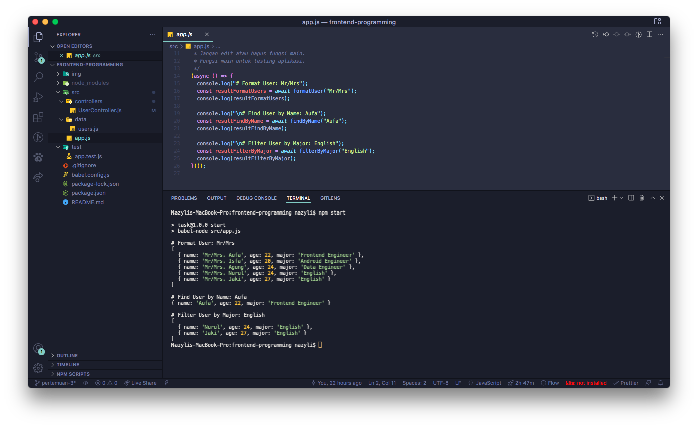
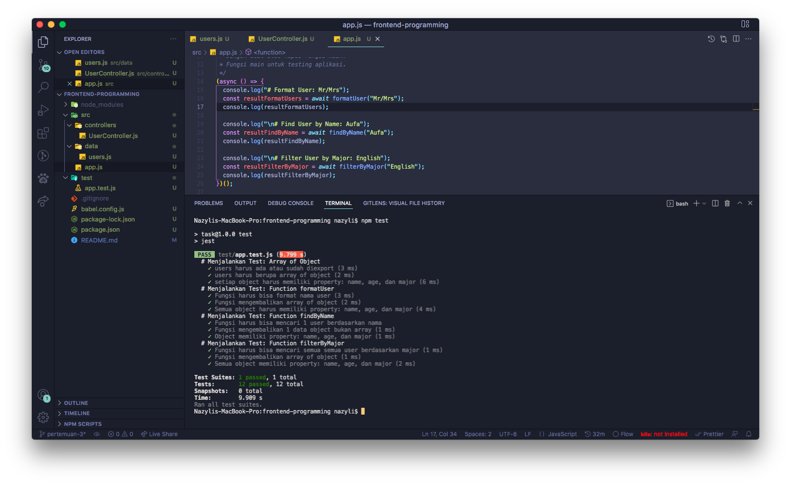

# Frontend Programming

STT Terpadu Nurul Fikri

Frontend Programming - 4SE02W (SEMESTER 4)

## Information

```bash
Nama   : Evry Nazyli Ciptanto
NIM    : 0110220045
Prodi  : Teknik Informatika
```

## Screenshots

### Results

### Test


# Task Pertemuan 3

## Deskripsi

- Practice Data Structure and Algorithm.
- Practice Module and Promise.
- Practice Modern JavaScript before Learning React.
- Practice TDD (Test Driven Development).

## Menjalankan Task

- Masuk ke folder task: `cd task`.
- Install dependencies: `npm install`.
- Jalankan task: `npm start`.
- Jalankan task (hot reload): `npm start:dev`

Note:

- Kodingan task di folder `src`.
- Folder dan file lain tidak perlu diubah.

## Menjalankan Test

- Jalankan test: `npm test`.
- Test harus berhasil semua.
- Folder `test` tidak perlu diubah.

## Ketentuan Pengumpulan

- Push task ke Repository Github.
- Task tidak perlu dizip dan folder `node_modules` tidak perlu diupload.
- Submit link repository ke Elena.
- Kamis, 10 Maret 2022, [Link Elena](https://elena.nurulfikri.ac.id/mod/assign/view.php?id=24691)
- Jumat, 12 Maret 2022, [Link Elena](https://elena.nurulfikri.ac.id/mod/assign/view.php?id=25630)
